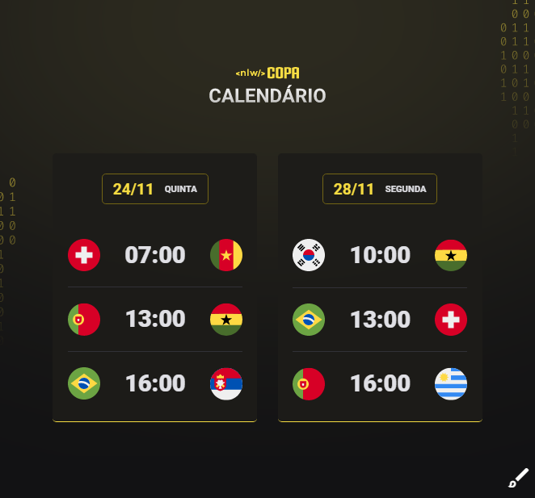

<h1 align="center"> NLW #10 Copa </h1>

 

> Evento exclusivo e gratuito, promovido pela Rocketseat para ensinar tecnologias WEB.

## 💻Tecnologias 
- HTML
- CSS
- Git e Github

## 📁Projeto

O calendário da Copa é um projeto que mostra os jogos da Copa de 2022.

## 📐Layout

Você pode visualizar o layout do projeto atráves [DESSE LINK](https://www.figma.com/file/0vgUMUVlHu8wOycAq38Q61/Calend%C3%A1rio-de-Jogos-(Community)?node-id=122%3A130). é necessário ter uma conta no [Figma](https://figma.com) para acessá-lo.